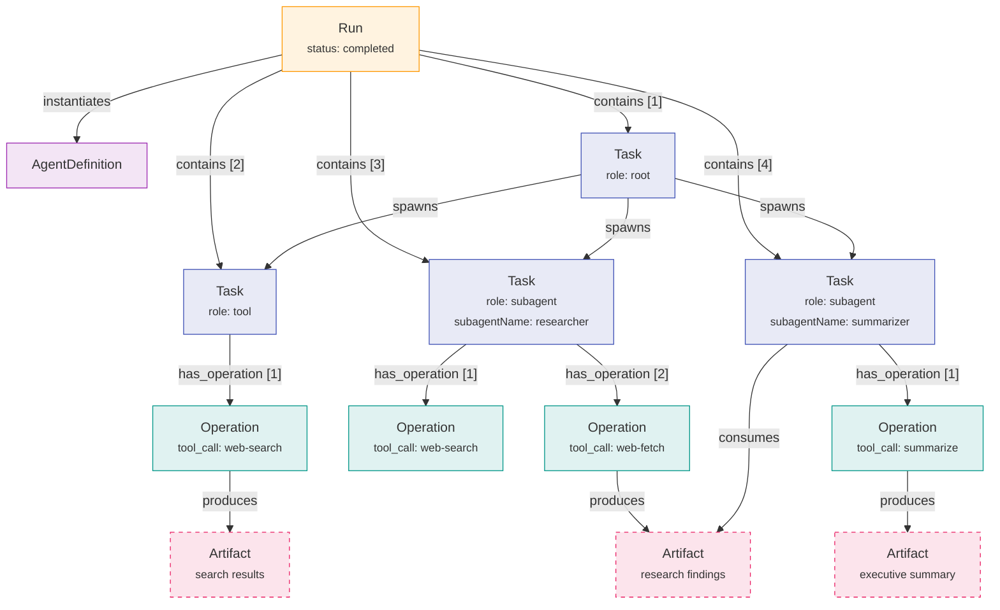
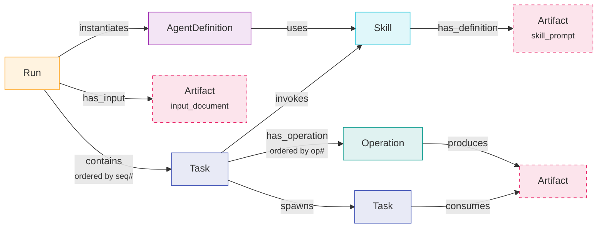
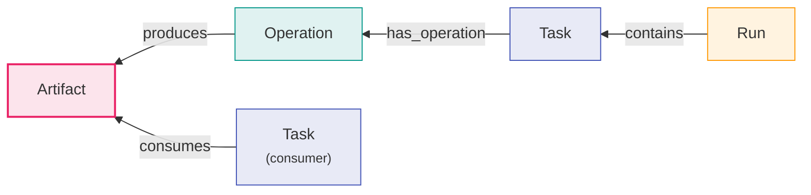

# Graph model

This system stores agent execution state as a graph using
[TypeGraph](https://github.com/niciaai/typegraph) — an open-source TypeScript
knowledge graph library for Postgres and SQLite. There is no relational schema.
There are no JOIN queries. This document explains the node/edge schema, why each
edge exists, and the traversal queries the system uses in practice.

---

## What is TypeGraph

TypeGraph is a typed knowledge graph library that runs on SQLite (via
libsql, better-sqlite3, or Cloudflare D1) and Postgres. It provides three things:

1. **Declarative schema** — nodes and edges are defined with `defineNode` and
   `defineEdge`, each backed by a Zod schema. The graph schema is a single
   TypeScript object (`defineGraph`) that the library uses to create and
   validate storage.

2. **Query builder** — a fluent API for graph traversals:
   `.from("Run", "r").traverse("contains", "e").to("Task", "t")`. Supports
   filtering (`whereNode`), ordering (`orderBy`), pagination (`paginate`),
   edge property access, and batch execution.

3. **Adapter interface** — the same graph schema and queries work against
   different SQLite backends. Locally, the adapter uses `libsql` (via
   `@nicia-ai/typegraph/sqlite/libsql`). In Cloudflare Workers, a D1 adapter
   bridges TypeGraph's interface to D1's async API (see
   [TypeGraph and Cloudflare D1](#typegraph-and-cloudflare-d1) below).
   The libsql backend enables sharing the same database file with agentfs
   (the virtual filesystem), so TypeGraph tables and agentfs tables coexist.

In this project, the graph schema lives in `packages/core/src/graph.ts`
(`nicatorGraph`, graph ID `nicator`). All storage operations go through the
`Repository` factory in `packages/core/src/repositories/`, which wraps
TypeGraph's store API (`NicatorStore`). Domain code never touches TypeGraph
directly.

---

## Why a graph

Agent execution state has a natural graph structure. A run contains tasks. Tasks
have operations. Operations produce artifacts. Tasks consume artifacts from prior
tasks. That last relationship — consumption — is a directed edge between two
nodes that belong to the same run.

### Compared to alternatives

**Relational (normalized tables).** Six tables, foreign keys, junction tables
for many-to-many relationships like `consumes`. Run lineage requires five
tables and four JOINs. Artifact provenance requires reverse-FK lookups plus
an array deserialization scan. The queries work, but they express _how to
reconstruct_ the structure rather than _what the structure is_. Every new
relationship type means a new table or column plus migration.

**Event store / event sourcing.** Events are append-only and natural for audit
trails, but answering "what is the current state of this run?" requires
replaying or maintaining a projection. The graph model gives you both: the
structure _is_ the current state, and the creation order of nodes and edges
_is_ the event log.

**Document database.** Embedding tasks inside a run document avoids JOINs but
makes cross-entity references (artifact provenance, skill usage counts)
require denormalization. Nested documents don't handle the `consumes` edge
cleanly — it crosses document boundaries.

**Graph.** Relationships are first-class. Run lineage is a single traversal.
Artifact provenance is an inbound walk on `produces` and `has_operation`. The
`consumes` edge — the hardest relationship to model relationally — is just an
edge. The graph is also directly renderable without translation.

### The three queries that justify it

**1. Run lineage** — given a run ID, return the complete audit trail: every task,
every operation, every artifact, in their structural relationships.

Relational: five tables, four JOINs, application-layer assembly.
Graph: one traversal. `Run → contains → Task → has_operation → Operation → produces → Artifact`.

**2. Artifact provenance** — given an artifact ID, trace it back to what produced
it and forward to what consumed it.

Relational: three reverse-FK lookups plus an array deserialization scan across
all tasks in the run.
Graph: inbound traversal on `produces` and `has_operation`, outbound scan on
`consumes`.

**3. Behavioral eval assertions** — after a run completes, assert structural
properties of the execution: "web-search was called directly," "HITL fired
before the researcher skill," "no unnecessary skill activations."

Relational: custom queries per assertion type, fragile when schema changes.
Graph: each assertion is a predicate on `RunLineage` — task existence, absence,
ordering by `sequenceNumber`, artifact content matching, and `consumes` edge
traversal. See [evals.md § Graph-based behavioral eval](evals.md#graph-based-behavioral-eval).

The eval use case is significant because it validates the graph model itself. If
a behavioral assertion cannot be expressed against the graph, the graph is
incomplete. This creates a feedback loop: new eval requirements drive graph
schema extensions.

Neither query is impossible relationally. All three are more direct as graph
traversals, and all three are directly renderable in a graph view without
translation — a set of JOIN results requires assembly before visualization.

---

## Three-tier execution model

The graph encodes a three-tier execution model:

```text
Run        — the whole user request, owns the agent loop
Task       — schedulable delegated work unit with its own context/policy/cancel semantics
Operation  — atomic recorded action (tool_call | hitl_response)
Artifact   — output produced by an operation
```



**Run** is the top-level container. It instantiates an AgentDefinition and
contains all Tasks created during execution.

**Task** is the unit of delegation and scheduling. Every Run has a **root Task**
representing the outer LLM loop. The root Task is a pure coordinator — it owns
no Operations directly. Every dispatch (tool call, subagent spawn, or HITL
request) creates a **child Task** linked to the root via a `spawns` edge.
Child Tasks have a `role` field (`tool`, `hitl`, or `subagent`). Subagent
Tasks carry `subagentName`. Skill-backed subagents additionally have an
`invokes` edge to the Skill node — this is how you determine whether a skill
was used. Tool-role and hitl-role Tasks have a single Operation each.

Clean rule: if something has its own prompt, context window, capability set,
budget, and termination behavior, it is a Task, not an Operation.

**Operation** is the unit of execution recording. Every tool call and HITL
response is an Operation. Operations are atomic — they run within a Task's
scope and are not independently schedulable. Context compression is recorded
separately as `Compaction` nodes linked to the Run via `has_compaction` edges.

This separation means:

- Policy enforcement happens at Task creation (before any Operation exists)
- Task-level cancellation is meaningful (cancel a subagent mid-execution)
- Inner tool calls within a subagent are recorded with the same fidelity as outer
  tool calls (consumes edges, latency, artifacts)

---

## Node types

Six node types, one per entity. Node IDs are UUIDs. Properties match the entity
Zod schemas in `packages/core/src/schema.ts` — the graph is the canonical store,
the Zod schemas validate at the boundary.

### `AgentDefinition`

Properties: `version`, `name`, `description`, `systemPrompt`, `limits`,
`workspace` (optional), `createdAt`.

Skills are **not** stored as a JSON property on the node. The relationship
between a definition and its skills is expressed as `uses` edges
(`AgentDefinition → Skill`) with an optional `policy` edge property. The
domain type (`AgentDefinitionSchema`) includes a `skills` array for
convenience — `Repository` reconstructs it from `uses` edges at read time.
The storage schema (`AgentDefinitionStorageSchema`) has no `skills` field.

### `Run`

Properties: `status`, `input`, `output`, `error`, `totalTokensUsed`, `createdAt`,
`updatedAt`, `completedAt`.

`agentDefinitionId` and `agentDefinitionVersion` are not properties — they are
expressed as the `instantiates` edge, which carries `version` as an edge property.

### `Task`

Properties: `role` (`root | tool | hitl | subagent`), `subagentName`
(optional), `status`, `input`, `createdAt`, `updatedAt`.

A Task is a schedulable delegated work unit. The root Task (`role: "root"`) is
a pure coordinator for the outer agent loop — it owns no Operations. Every
dispatch creates a child Task: `tool` for direct tool calls, `hitl` for
human-approval requests, and `subagent` for delegated reasoning work. Subagent
Tasks carry `subagentName` — the human-readable label. Skill-backed subagents
have an `invokes` edge to the Skill node (the authoritative way to determine
whether a skill was used). `input` contains the typed invocation parameters.

`runId`, `parentTaskId`, and `artifactDependencies` are not properties — they are
the `contains`, `spawns`, and `consumes` edges respectively. `sequenceNumber`
lives on the `contains` edge, not the node.

### `Operation`

Properties: `type` (tool_call | hitl_response), `status`, `input`, `output`,
`error`, `inputTokens`, `outputTokens`, `latencyMs`, `createdAt`, `completedAt`.

An Operation is an atomic recorded action within a Task. Every tool call — whether
in the outer loop or inside a skill's sub-loop — is an Operation. HITL responses
are also Operations. Context compression is a separate concern — compactions are
stored as `Compaction` nodes linked to the Run via `has_compaction` edges.
Operations are numbered within their parent Task (1-indexed via `operationNumber`
on the `has_operation` edge — see [has_operation](#has_operation) below).

`taskId`, `runId`, and `operationNumber` are not node properties — they are
recovered by traversing inbound `has_operation` (which carries `operationNumber`
as an edge property) and following its parent `contains` edge to the run.

### `Artifact`

Properties: `type` (text | json | file_reference | hitl_decision | skill_prompt
| skill_asset | input_document), `name`, `content`, `contentHash`, `mimeType`,
`createdAt`.

`contentHash` is a SHA-256 hex digest of the artifact's content, computed at
creation time. It serves two purposes: **deduplication** — if an artifact with
the same `contentHash` already exists in the run, the repository returns the
existing node instead of creating a duplicate; and **versioning** — when the
same logical artifact (matched by name within the run) is written with new
content, the repository creates a new Artifact node and links it to the
previous version via a `supersedes` edge, forming a version chain. See
[`supersedes`](#supersedes) below.

Artifacts have no `runId`, `taskId`, or `operationId` properties — all
directionality is in edges. Provenance is recovered by inbound traversal
through `produces → has_operation → contains`. Skill-owned artifacts are
reached via `has_definition` and `has_asset`. User-supplied input artifacts
are reached via `has_input` from the Run.

### `Skill`

Properties: `name`, `version`, `description`, `maxIterations` (optional).

Skills are graph nodes linked to their prompt content via `has_definition`
edges (pointing to `skill_prompt` artifacts) and to supporting files via
`has_asset` edges (pointing to `skill_asset` artifacts). At run start, skills
are materialized to the workspace filesystem at `skills/[name]@[version]/SKILL.md`
and read from there at activation time. Skill fixtures live in
`fixtures/skills/*.json`.

---

## Edge types

### `instantiates`

`Run → AgentDefinition`
Properties: `version: number`

Created when a Run is created. The `version` edge property is derived from the
definition node at creation time — it is not caller-supplied. Records which
specific version of the definition was active at run time. Immutable after
creation.

### `contains`

`Run → Task`
Properties: `sequenceNumber: number`

Created when a Task is created during a run. The `sequenceNumber` is the
task's emergence order within the run — not pre-assigned, incremented as tasks
are created. Ordering tasks by `sequenceNumber` on the `contains` edges
reconstructs the run's execution sequence without a sort column on the Task node.

### `spawns`

`Task → Task`
Properties: none

Created when one task delegates work to another. The parent is typically the
root Task; the child is often a subagent Task. Enables traversal of the Task
hierarchy: root → delegated subagents → (future: deeper nesting).

### `invokes`

`Task → Skill`
Properties: none

Created for skill-backed subagent Tasks (those spawned via
`spawn_subagent_with_skill`). Links the Task to the Skill node for the
invoked version. The `invokes` edge is the authoritative way to determine
whether a subagent used a skill — this information does not live on the Task
node itself. Root, tool, hitl, and ad-hoc subagents (spawned via
`spawn_subagent`) have no `invokes` edge.

### `has_operation`

`Task → Operation`
Properties: `operationNumber: number`

Created when an Operation is created. `operationNumber` is 1-indexed within the
task. A task with three operations has three `has_operation` edges with
`operationNumber` 1, 2, 3. `operationNumber` lives on the edge rather than the
Operation node because it is a positional property — it describes where an
operation sits within its parent task, not an intrinsic property of the operation
itself. Same rationale as `sequenceNumber` on the `contains` edge.

### `produces`

`Operation → Artifact`
Properties: none

Created when an Operation produces an Artifact. One operation may produce multiple
artifacts (e.g. a search skill produces both a results list and a summary).
Each artifact gets its own `produces` edge from the same operation.

### `consumes`

`Task → Artifact`
Properties: none

Created when the agent accesses an artifact's content via `read_artifact` —
not when the task is created, since dependencies are not known in advance.
The semantic is "this artifact's content was read by the model," not merely
"this artifact existed." Artifacts that appear only in the metadata tier
(a count in a context summary) do not get `consumes` edges because the
model never reads their content.

This edge makes the run's data flow explicit and traversable. The question "which
artifacts did this task use as input?" is answered by following outbound `consumes`
edges from the task. The question "which tasks used this artifact?" is answered by
following inbound `consumes` edges to the artifact.

### `uses`

`AgentDefinition → Skill`
Properties: `policy` (optional — `PolicySchema`)

Records which skills an agent definition can invoke and the policy governing
each. Replaces the former `skills` JSON array on AgentDefinition. The domain
type reconstructs `skills` from these edges at read time.

### `has_input`

`Run → Artifact`
Properties: none

Links a Run to user-supplied input artifacts (type `input_document`). These
replace the former `SourceDocument` concept — input documents are now
first-class artifacts linked via edges rather than a separate type.

### `has_definition`

`Skill → Artifact`
Properties: none

Links a Skill node to its prompt artifact (type `skill_prompt`). The prompt
content is the skill's system prompt — the body of the `SKILL.md` file.

### `has_asset`

`Skill → Artifact`
Properties: none

Links a Skill node to supporting file artifacts (type `skill_asset`).
These are additional files that the skill needs at activation time.

### `supersedes`

`Artifact → Artifact`
Properties: none

Created when a new version of a logical artifact replaces an older one. The
repository matches artifacts by name within the run: if an artifact with the
same name but different `contentHash` already exists, the new node gets a
`supersedes` edge pointing to the previous version. Following the chain of
`supersedes` edges from any artifact reconstructs the full version history
of that logical output. Originals are never deleted or mutated.

### `has_compaction`

`Run → Compaction`
Properties: none

Created when the harness compresses earlier operation context into a summary.
Links the Run to its `Compaction` node(s). The original Operations are
preserved — only the context rendering changes. Compactions are a separate
node type from Operations; context compression does not produce synthetic
Operations.

---

## Key traversals

### Full run lineage



Returns `RunLineage` — the complete audit trail of a run in a single traversal.
Used by `GET /runs/:id/lineage`.

**Implementation:** `Repository.getRunLineage` calls `store.subgraph(runId)`
with all edge kinds and `maxDepth: 4`. This compiles to a single
`WITH RECURSIVE` CTE — the database performs the traversal, and the
Repository assembles the `RunLineage` shape in memory from the flat
`{ nodes, edges }` result using pre-built index maps. No per-task or
per-operation queries.

### Artifact provenance



Answers: what created this artifact, and what used it? Useful for debugging
unexpected outputs — you can trace any claim in the final output back to the
operation that produced the artifact it came from.

**Implementation:** `Repository.getArtifactProvenance` calls
`store.subgraph(artifactId)` with `direction: "both"` and `maxDepth: 4`.
The bidirectional CTE walks inbound edges (produces, has_operation, contains)
to reach the producing Run, and follows consumes edges to find consumer
Tasks. One SQL statement, no sequential chain-walking.

### Skill usage across a run

```text
Run
  -[contains]→ Task
    -[invokes]→ Skill (filter: name = X)
```

Used by the `max_calls_per_run` policy check — count how many tasks in this run
have already invoked a given skill before allowing another invocation.

Note: `awaiting_hitl` status on Task and Run derives from any HITL dispatch —
either an explicit `human-approval` call or a `require_hitl_approval` policy
on a skill — not from a task type discriminator.

---

## Indexes

Node indexes are defined on properties used in `whereNode` filters and
`orderBy` clauses: `Run.status`, `Run.createdAt`, `Task.sequenceNumber`,
`Task.status`, `Operation.operationNumber`, `Operation.status`, `Skill.name`,
`AgentDefinition.createdAt`.

Edge indexes use TypeGraph's `direction` option to prefix the traversal
join key (`from_id` for outbound, `to_id` for inbound) ahead of the
property key:

- `contains` — direction `"out"`, field `sequenceNumber`. Optimizes the
  `Run → Task` traversal with ordering by emergence sequence.
- `has_operation` — direction `"out"`, field `operationNumber`. Optimizes the
  `Task → Operation` traversal with ordering by operation number.

Both index definitions live in `packages/core/src/graph.ts` alongside the
node indexes. TypeGraph's built-in indexes cover basic `from_id` / `to_id`
lookups for edges without application-specific properties.

---

## TypeGraph and Cloudflare D1

Locally, TypeGraph uses `@libsql/client` (async, via `createLibsqlBackend`).
Cloudflare D1 is SQLite-compatible but exposes its own async API. Both are
bridged via TypeGraph's `createSqliteBackend` with appropriate execution
profiles. The libsql backend shares the same database file with agentfs,
enabling graph annotations over workspace files.

If TypeGraph's adapter interface cannot be bridged to D1's async API cleanly,
the fallback is two generic tables (`tg_nodes`, `tg_edges`) with JSON property
blobs, with the TypeGraph adapter interface implemented against those tables
directly. This preserves the graph model at the application layer.

The same graph schema and traversal queries work identically in both cases. The
adapter is the only thing that changes between Workers and Node environments.
